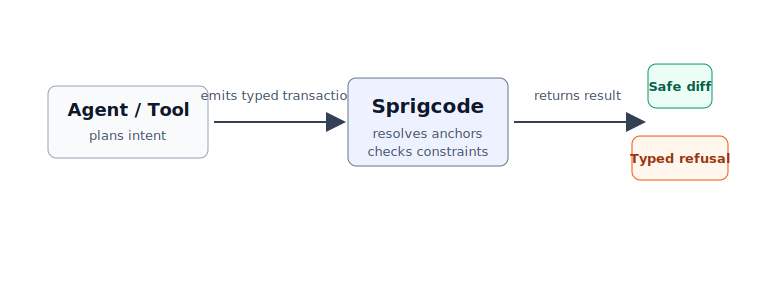

# Agent Integration Guide

Sprigcode can sit between a planning system and the filesystem. The caller can
be an AI coding tool, MCP-style tool, IDE assistant, migration runner, or
automated PR system. The shape is the same: the caller emits intent as a typed
transaction, and Sprigcode decides whether that transaction can be applied
safely.



This guide describes an integration pattern. It does not claim a production
integration exists.

## Basic flow

1. The user asks for a code change.
2. The agent or tool plans the change in terms of intent.
3. The agent emits a Sprigcode transaction document.
4. Sprigcode validates the transaction shape and operation types.
5. The TypeScript adapter resolves anchors and plans minimal edits.
6. Sprigcode checks constraints such as `match_count` and `idempotent`.
7. Sprigcode applies only if anchors, constraints, and edit conflicts pass.
8. The caller receives a deterministic diff summary or a typed error.

The caller should treat typed refusal as a normal result. A refusal means the
engine did not have enough evidence to edit safely.

## Example user request

> Add a rate limit check before password reset emails.

An agent can reason about the requested behavior and inspect the codebase, but
it should not need to rewrite the target file directly. Instead, it can emit a
transaction that states the intended mutation:

```json
{
  "version": "0.1",
  "language": "typescript",
  "description": "Add a rate limit check before password reset emails.",
  "ops": [
    {
      "id": "add-rate-limit-import",
      "op": "add_import",
      "file": "src/auth/reset-password.ts",
      "from": "@/lib/rate-limit",
      "named": ["rateLimit"]
    },
    {
      "id": "insert-rate-limit-check",
      "op": "insert_statement_before_call",
      "anchor": {
        "type": "call",
        "callee": "sendPasswordResetEmail",
        "file": "src/auth/reset-password.ts",
        "enclosingFunction": "requestPasswordReset"
      },
      "statement": "await rateLimit.check(email);"
    }
  ],
  "constraints": [
    {
      "type": "match_count",
      "opId": "insert-rate-limit-check",
      "exactly": 1
    },
    {
      "type": "idempotent"
    }
  ]
}
```

The agent decides what should happen. Sprigcode decides whether the anchor
uniquely identifies a supported edit location and whether the transaction stays
idempotent.

## Caller responsibilities

The caller should provide:

- a workspace root
- a transaction document
- language adapters for the languages it wants Sprigcode to handle
- a policy for displaying diffs or typed errors to the user

The caller should not treat Sprigcode as an arbitrary code generator. It should
not ask for unsupported operations to be smuggled through broad file writes. If
the desired edit cannot be represented yet, the integration should report that
limitation or fall back to a different reviewed workflow.

## Sprigcode responsibilities

Sprigcode should:

- validate the transaction document
- reject unsupported languages and operations
- resolve semantic anchors through the relevant adapter
- refuse ambiguous or missing anchors
- plan minimal text edits
- detect conflicting edits
- apply only after planning succeeds
- verify constraints
- return a diff summary or typed error

The important integration point is the result object. Callers should branch on
the typed status, not scrape human prose.

## Possible results

For the password reset request, Sprigcode can return a successful result with a
deterministic diff summary:

```text
Transaction verified.
Lifecycle: validated -> planned -> applied -> verified
Typed operations: 2
Files changed: 1
Rollback: no
Diff summary:
  src/auth/reset-password.ts (+2 -0)
```

Or it can refuse before writing:

```json
{
  "ok": false,
  "error": {
    "code": "ANCHOR_NOT_UNIQUE",
    "message": "Found 2 matching calls to sendPasswordResetEmail."
  }
}
```

Other expected failures include `INVALID_TRANSACTION_DOCUMENT`,
`UNSUPPORTED_OPERATION`, `UNSUPPORTED_SYNTAX`, `ANCHOR_NOT_FOUND`,
`MATCH_COUNT_FAILED`, `CONFLICTING_EDITS`, `TYPECHECK_FAILED`, and
`NON_IDEMPOTENT_TRANSACTION`.

## Integration patterns

An MCP-style tool can expose a `sprigcode.applyTransaction` tool that accepts a
transaction document and returns JSON. The model plans the operation, but the
tool owns the mutation boundary.

An IDE assistant can preview the transaction and show the deterministic diff
before applying it. If Sprigcode refuses, the IDE can show the typed error and
anchor candidates rather than opening a partially edited file.

An automated PR system can require transactions for common edits, run them in a
clean checkout, attach the diff to a PR, and fail the job on typed refusal. That
makes failure reviewable and keeps unsupported edits out of the generated patch.

## Policy guidance

Use Sprigcode when the edit can be expressed as a supported typed operation and
when refusing is safer than guessing.

Do not use Sprigcode as a bypass for arbitrary source rewriting. If an edit
needs a broad custom transformation, use a codemod or a reviewed script. If an
edit needs unsupported syntax or language coverage, file a fixture case and make
the limitation explicit.
